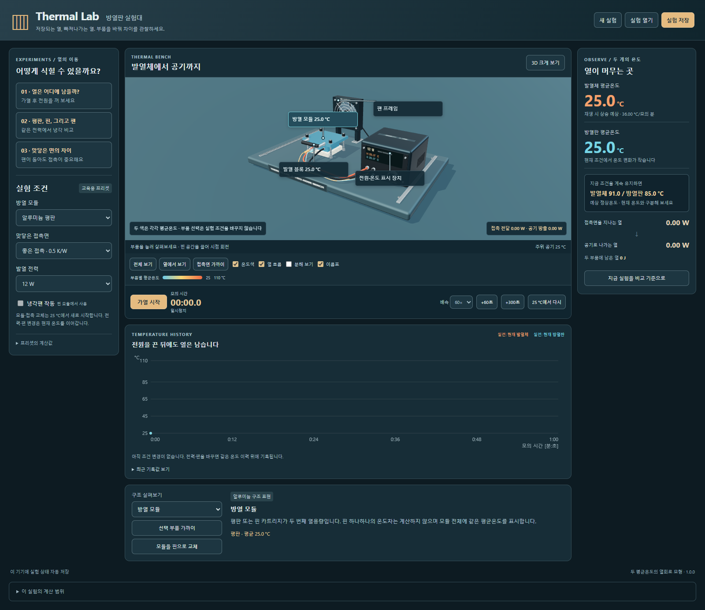

# Thermal Lab

히터와 방열 모듈의 가열·냉각·접촉 저항을 관찰하는 한국어 교육용 실험 앱입니다. 구조를 살펴보고 전력·팬·접촉 조건을 바꾸며 두 물체에 열이 저장되고 빠져나가는 과정을 비교합니다.

[Windows 설치 파일](https://github.com/Ulsancl/thermal-lab/releases/latest)과 [설치·업데이트 안내](docs/desktop.md)를 확인하세요. 버전별 실제 검증 범위는 릴리스 기록을 따릅니다.



동판 히터, 접촉 패드, 평판/핀 방열 카트리지, 팬과 보호망, 두 온도 프로브를 살펴봅니다. 온도 색은 각 물체의 **평균 온도 두 개**를 같은 범례로 표현합니다. 핀 끝의 가짜 온도 구배나 실제 열화상 영상이 아닙니다. 팬 회전과 열 흐름 화살표는 설명용이며 RPM·유속을 계산하지 않습니다.

25 °C에서 시작하여 0 / 4 / 8 / 12 W로 가열합니다. 전력과 핀 모듈의 팬 변경은 현재 온도를 유지하고 시간 이력에 기록합니다. 모듈이나 접촉 조건을 바꾸면 새 조건으로 25 °C에서 다시 시작합니다. 일시정지는 모형 시간을 멈추며 전력을 0 W로 바꾸는 동작과 다릅니다. 1× / 10× / 60×는 모형 시간 배속이고, +60초·+300초도 실제 과도응답을 계산합니다.

가열 후 냉각, 평판→핀→팬 비교, 좋은 접촉과 나쁜 접촉 비교의 세 안내 실험을 제공합니다. 안내는 실제 온도·시간·에너지 조건을 관찰한 뒤 진행합니다. 예상 정상온도와 현재 온도는 구분하며 정상온도를 현재 상태에 붙여 넣지 않습니다. 비교 실험은 별도 이력으로 보관하고 안내 진행은 세션 안에서만 유지합니다.

일시정지 중 표시하는 변화율은 현재 조건에서 모형 시간을 진행할 때의 기울기이며, 멈춘 화면의 온도가 계속 변한다는 뜻이 아닙니다. 보관한 실험은 같은 시간·온도 축에서 비교합니다. 두 이력이 겹치면 표시할 곡선을 전환하거나 보관 기록의 마지막 시간과 온도 수치로 확인할 수 있습니다.

## 개발 실행

Node.js 24 계열에서 다음 명령을 사용합니다.

```powershell
npm ci
npm run dev
```

`npm test`는 모형·실험 이력·기하·안내·저장·원자적 저장 검사를 실행합니다. `npm run test:browser`는 화면 조작, `npm run test:consumer`는 소비자 관찰 화면 검사입니다. `npm run build`로 웹 산출물을 만들고 `npm run desktop`으로 앱을 엽니다. 네이티브 검사는 `node scripts/desktop.mjs prepare-test` 후 `npm run test:desktop`을 사용합니다. 화면을 쓰는 검사는 동시에 실행하지 마세요.

Windows CI는 잠긴 의존성 설치, 순수 검사, 웹 빌드, 브라우저, 소비자 관찰, 소스 네이티브, 패키징, 독립 실행 파일 네이티브 순서로 진행합니다. 설치 파일 해시·고지도 확인하고 실패 화면과 결과를 보관합니다. 자동 릴리스 게시는 하지 않습니다. CI의 가상 환경 결과와 실제 하드웨어 결과는 구분합니다.

`npm run package:desktop`은 Windows x64 설치 파일과 SHA-256 파일을 생성합니다. 설치 앱은 로컬 파일만으로 실행하고 Node.js나 개발 서버가 필요하지 않습니다. 개발 의존성 설치에는 인터넷이 필요할 수 있습니다. 코드 서명과 자동 업데이트는 제공하지 않습니다. 대상은 Windows 11 x64이며 실제 호환성·설치·업데이트 결과는 해당 검증 기록을 따릅니다.

## 범위와 자료

두 물체의 평균 온도를 계산하는 선형 열회로입니다. 열용량·접촉 저항·공기 방출 계수는 **교육용 예시값**이며 실제 제품이나 메시 형상을 측정해 얻은 값이 아닙니다. 복사·히터에서 공기로 직접 빠지는 열·공간 온도 분포·CFD·실제 장치 안전성을 계산하지 않습니다. 제조사 설계도, 방열판 최적화 또는 실제 전자제품 온도 예측 도구가 아닙니다.

- [세 실험과 단위](docs/experiments.md), [모형](docs/model.md), [구조](docs/anatomy.md).
- [저장과 복원](docs/storage.md), [Windows 앱](docs/desktop.md), [개인정보](docs/privacy.md).
- [완성 기준과 한계](docs/release-scope.md), [문제 보고](docs/support.md).
- [원리 참고](docs/references.md), [제3자 고지](docs/THIRD-PARTY-NOTICES.md).

자체 코드·문서·기하·아이콘의 권리 표기는 `LICENSE.txt`의 UNLICENSED입니다. 외부 라이브러리에는 각자의 라이선스가 적용됩니다. 제조사 사진·CAD·강의 자료나 외부 폰트를 번들하지 않습니다.
